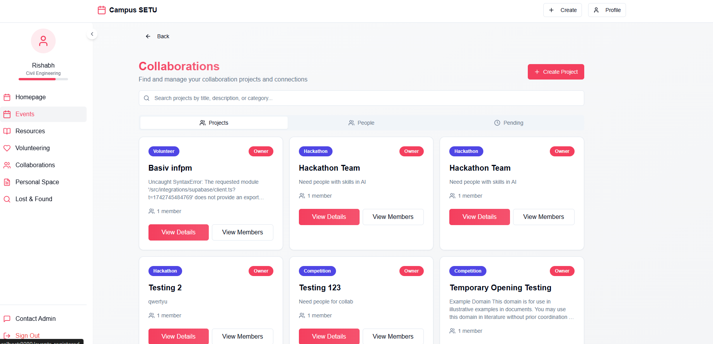
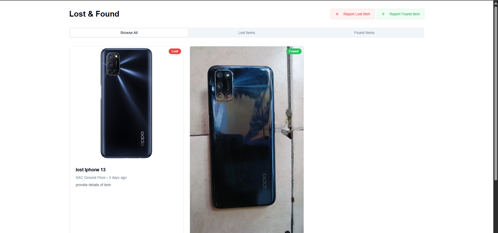

# About

Campus SETU is feature-rich , multipurpose - web app platform aimed at improving engazement among students within campus.

Campus SETU is a smart, collaborative platform designed to transform how students, clubs, and administrators interact on campus. It helps you find like-minded people, join communities, organize events, and automate campus operations—all in one place.

## Features

### For Students

- *Skill-Based Matchmaking & Personalized Recommendations*  
  Add your skills, interests, and preferences—Campus Connect suggests relevant events, clubs, people, and resources tailored just for you.

- *Instant Collaboration Spaces*  
  Form temporary groups for study sessions, projects, event planning, or skill-building. Find teammates and collaborators based on shared goals or expertise.

- *Smart Event Discovery*  
  Get a curated list of upcoming events that match your profile—never miss something worth attending.

- *View & Connect with Profiles*  
  Explore detailed profiles of fellow students, club members, and event participants—find common ground and build your network.

- *Secure Resource Sharing*  
  Share and access internships, study materials, and campus resources. All content is AI-moderated to keep the community clean and safe.

- *Volunteering & Emergency Participation*  
  Take part in blood donation drives, cleanups, or urgent needs—get notified in real time when help is needed.

- *Lost & Found with Image Recognition*  
  Lost something? Post a photo. Found something? Upload it. Our AI matches items visually to help reconnect them with their owners.

- *AI Alerts & Smart Reminders*  
  Stay on top of events, deadlines, and opportunities with intelligent, personalized alerts based on your campus activity.

---

### For Clubs & Communities

- *Comprehensive Event Management*  
  Organize events with ease—handle creation, registrations, communication, and post-event tracking from one place.

- *Automated and Manual Attendee Approvals*  
  Let the system auto-approve attendees based on pre-set criteria—save time while keeping control.

- *Attendance & Verification System*  
  Use QR codes for check-ins, verify attendee presence, and track engagement effortlessly.

- *Member & Role Management*  
  Add or remove members, assign leadership roles, and streamline internal operations with structured access control.

- *Targeted Promotion & Visibility*  
  Get discovered by students whose skills and interests align with your club’s mission and events.

---

### For Campus Admins

- *Full Administrative Control*  
  Oversee all user activity, event creation, club management, and content uploads. Step in when moderation or decisions are required.

- *Automation Tools*  
  Set up workflows for approvals, notifications, and emergency protocols to reduce manual overhead.

- *Emergency Coordination*  
  Broadcast campus-wide alerts, manage responses, and maintain communication during crises or important updates.

- *Analytics & Engagement Insights*  
  Access dashboards and data on student involvement, event success, and campus trends to drive smarter decisions.

## Installation

Use the package manager npm to install foobar.

bash
#clone repo
git clone https://github.com/yogesh-garg-m/hackmol-final.git
#move to repo
cd hackmol-final
#install dependencies
npm install
#start server
npm run dev
#enter new terminal
#move to backend-email-server
npm install
npm start 

## Tech Stack

*Frontend:*
- [React](https://reactjs.org/)
- [Vite](https://vitejs.dev/)
- [Tailwind CSS](https://tailwindcss.com/)
- [Radix UI](https://www.radix-ui.com/)
- [shadcn/ui](https://ui.shadcn.com/)
- [JavaScript](https://developer.mozilla.org/en-US/docs/Web/JavaScript)
- [TypeScript](https://www.typescriptlang.org/)
- [TanStack Query](https://tanstack.com/query) (React Query) and related libraries

*Backend:*
- [Node.js](https://nodejs.org/)
- [Express.js](https://expressjs.com/)

*Database & Auth:*
- [Supabase](https://supabase.com/)

*AI & Language Processing:*
- [GROQ Cloud](https://groq.com/) (for high-speed LLM inference)
- [CLIP Model](huggingface.com)

## Screenshots

  
  
  
  
  
  
  
  
  
  
  
  

---
Lets make campuses more smarter and more connected ---
together